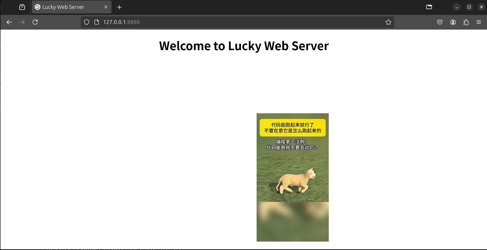
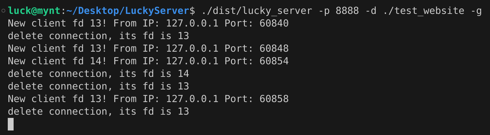
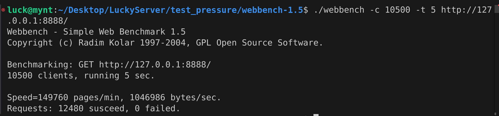

# Lucky Server

*Lucky Server* is a **toy web server**, written in modern C++.

We developed it as homework for *System Design and Development Practice*, a computer science course taught by Mr. Kong.

Moreover, we want to learn how to develop a simple web server by ourselves through coding this project and provide some relevant experience to other students who are interested in server development.

# Build

To build *Lucky Server*, you need to install the C/C++ development environment on your Linux system (like Ubuntu):

```shell
sudo apt-get install build-essential
```

Then, enter the root directory of the *Lucky Server* project and run the building command. 

This command will invoke the g++ compiler and build an executable file called lucky_server in the dist directory.

```shell
make lucky_server
```

Good, now you have built *Lucky Server*!

# Run

It's very easy to run *Lucky Server*. Let's figure it out with a specific example.

After successfully building *Lucky Server*, just execute this command to run it:

```shell
./dist/lucky_server -p 8888 -d ./test_website -g
```
Then, open your browser and access http://localhost:8888, and you should see this page:



At the same time, you should notice some information has been printed in your terminal:



Ok, now *Lucky Server* is running successfully. It's very easy for you, right?

Although you might understand the function of the options when you run the server, let me explain them again:

- `-p`: The port that the server should listen to.
- `-d`: The directory that the server should choose as its current working directory.
- `-g`: Whether to enable the server's debugging mode. If the debugging mode is disabled, you will not see the debugging information in your terminal.

# Test Tools

Besides the web server itself, we also provide some tools to test the core code of *Lucky Server*.

The source code of these tools is in the app directory as well. You can also use the make command to build and explore them.

- echo_server
- single_client
- multi_client
- test_thread_pool

# Webbench

We also provide another tool named Webbench to test the performance of the server.

Its usage is also very simple; please read the README.md in the test_pressure directory by yourself.

On my own computer, after I run this pressure testing command:

```shell
./webbench -c 10500 -t 30 http://127.0.0.1:8888/
```

I got this testing report generated by Webbench:



# Reference

Here are the reference materials we used while developing *Lucky Server*. Thanks to their authors:

- https://github.com/yuesong-feng/30dayMakeCppServer

- https://github.com/qinguoyi/TinyWebServer

- https://mp.weixin.qq.com/s/5xj42JPKG8o5T7hjXIKywg